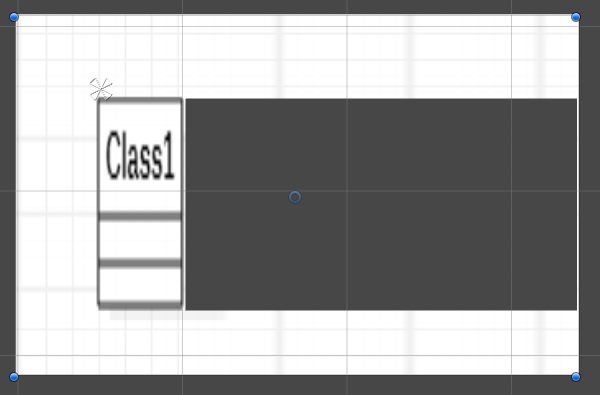
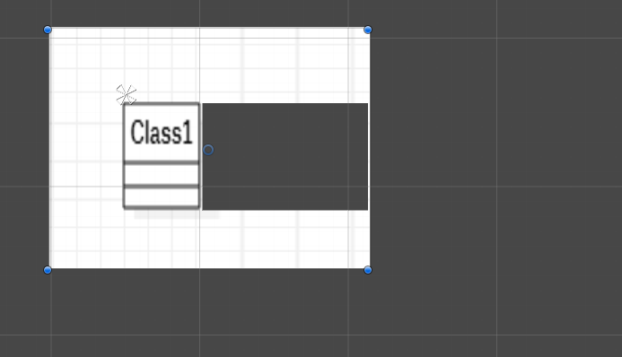
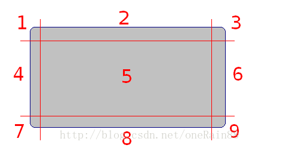
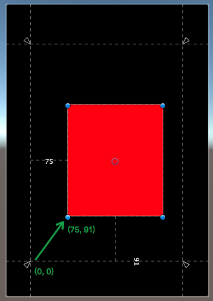
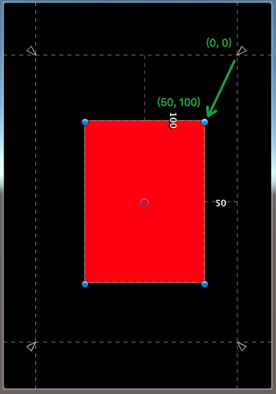
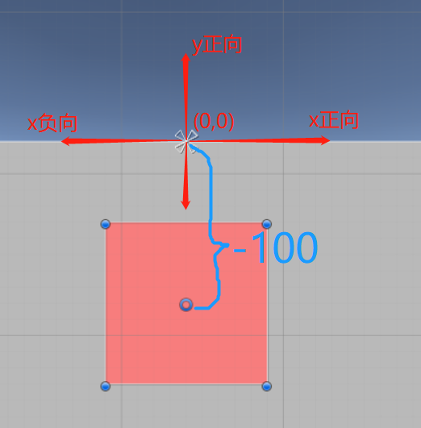
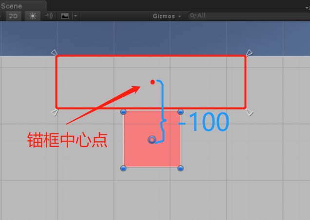

# Unity UGUI学习

## UGUI 中的坐标系

## 九宫格的实现原理（纯属推测）
我们知道当我们在使用九宫格来拉伸图形的时候，只有九宫格中的中间部分会被上下左右拉伸，而就宫格的其他部分则只会进行一个方向的拉伸(当然缩小的时候各个部分还是会做对应的拉伸)。
如下所示。

我们把九宫格的中间部分在Image中裁掉，这样会留下一片空白。

进行拉伸后

可以发现在拉伸之后九宫格中间部分距离上下左右边界的距离是不变的，那么可以猜测实质上九宫格其实是对uv坐标的操作。通过设置中间四个点的uv坐标来做到在图片的拉伸过程中显示出来的贴图上下部分（图中2，8）只拉伸左右，而左右部分（图中4，6）只拉伸上下，中间的部分上下左右拉伸的效果。，因为4个部分都只拉伸部分，最后就会造成2,4,6,8部分有一种没有被拉伸的效果(这里指的是uv贴图采样后的结果实际上图还是被拉伸的)只如下图所示。

## Unity 中的Auto Layout System
当游戏分辨率改变时Unity能自动的控制控件的位置和大小，而Unity时通过它自己的一个Auto Layout System来实现这一功能的，Unity 的Auto Layout System 主要由Layout Element 和Layout Controller组成，其中Layout Element 主要用来提供控件的一些特定信息给Layout Controller，Layout Controller则是用来控制控件的显示大小和位置。

每当游戏分辨率改变的时候Layout Controller 都会根据LayoutElement提供的信息来调整控件的大小和位置。

一个Layout Element 主要管理如下几个值
Minimum width
Minimum height
Preferred width
Preferred height
Flexible width
Flexible height

每一个带有RectTransform 组件的gameobject都有设置上面属性的默认值，一般为零，这些值一般只能由Layout Element或者其他一些Component来修改，Text和Image是例外，他们会自动更改这些值。
在Unity中，我们可以自定义自己的一个Layout System。

我们可以让系统重新计算一次Layout，通过调用**LayoutRebuilder.MarkLayoutForRebuild (transform as RectTransform)**，重计算Layout不会立刻发生，它会发生在当前帧的结尾。以免重复的计算Layout影响性能。

https://docs.unity3d.com/2017.4/Documentation/Manual/UIAutoLayout.html

## Unity UGUI Canvas
Canvas划分是个很大的话题。简单来说，因为一个Canvas下的所有UI元素都是合在一个Mesh中的，过大的Mesh在更新时开销很大(**Canvas 网格重建**)，所以一般建议每个较复杂的UI界面，都自成一个Canvas(可以是子Canvas)，在UI界面很复杂时，甚至要划分更多的子Canvas。同时还要注意动态元素和静态元素的分离，因为动态元素会导致Canvas的mesh的更新。最后，Canvas又不能细分的太多，因为会导致Draw Call的上升。

当Unity的Canvas进行网格构建的时候，会将其下所有的UI元素基于元素渲染顺序和所使用的到的Material进行一次排序，这样做的目的在于降低DrawCall的次数。当Canvas下的元素数量越大这种网格重建的耗时就越高。

- 当我们修改UI组件上的Color属性的时候会导致该UI组件所属Canvas进行网格重建。
- 当我们通过脚本去修改UI组件中使用到shader的Init_Color属性时，并不会导致Canvas进行网格重建，但是会增加一次DrawCall，因为用代码去修改的时候，Unity会自动的创建一个原来Material 的拷贝。不同的Material 是不会被Batch到一起的。
- 粒子系统的渲染和UI系统的渲染是分开的，所以一个绑定粒子效果的Canvas，并不会因为这个粒子系统而导致重建。

## Unity UI布局

### RectTransform 组件属性

#### Pivot
Pivot 表示一个UI的中心点，它的坐标原点在UI的左下角，在UI内坐标范围[0,1]

#### Anchors
Anchor锚框是由两个锚点(Min，Max)组成的一个矩形，当然也可以组成一个点（两个点重合）。当Anchor是一个锚框的时候UI元素的边界会和锚框保持一个固定的值。

当我们想要让UI元素和父物体中的某个位置保持一个不变的距离的时候使用锚点。

==Anchor Max==
锚框右上角的点在父物体中的坐标，坐标原点在父物体的左下角,坐标范围在[0,1]

==Anchor Min==
锚框左下角的点在父物体中的坐标，坐标原点在父物体的左下角,坐标范围在[0,1]

#### OffsetMax,OffsetMin
offsetMin 表示UI元素的左下角相对AnchorMin的偏移量，offsetMax表示UI元素右上角相对AnchorMax的偏移
offsetMin = UI元素的左下角 - AnchorMin
offsetMax = UI元素右上角 - AnchorMax

#### sizeDelta
sizeDelta = offsetMax - offsetMin
当Anchor为一个锚点的时候该变量可以表示UI元素的大小,此时可以通过该值改变UI元素的大小。

#### anchorPosition
UI元素轴心点距离锚点的距离，坐标原点是锚点的位置，当Anchor为锚框的时候锚点的位置锚框的中心点。

#### rect
一个UI元素的Rect属性，无论Anchor是在锚点状态还是在锚框状态下都可以获取到UI的实际大小。
rect.x和rect.y表示的是以UI的Pivot为原点UI元素左下角的坐标。

--------------
### 常用的布局方法

#### [RectTransform.SetSizeWithCurrentAnchors(Animations.Axis axis, float size)](https://docs.unity3d.com/ScriptReference/RectTransform.SetSizeWithCurrentAnchors.html)
这个方法无论在Anchor为锚点还是锚框的情况下，都可以通过直接设置rect中的width和height值来改变UI元素的大小。并且在改变大小的同时UI元素的anchorPosition保持不变

#### [SetInsetAndSizeFromParentEdge(RectTransform.Edge edge, float inset, float size)](https://docs.unity3d.com/ScriptReference/RectTransform.SetInsetAndSizeFromParentEdge.html)
调用这个方法，可以根据父物体的Edge（某一边）去布局。其中第一个参数就是用于确定基准的边，第二个参数是UI元素的该边界与父物体该边界的距离，第三个元素是设定选定轴上UI元素的大小

在使用这个方法的时候要注意锚点也会改变，改变的规则为

- 以左边界为基准时，anchorMin和anchorMax 的y不变x变为0.
- 以右边界为基准时，anchorMin和anchorMax 的y不变x变为1.
- 以上边界为基准时，anchorMin和anchorMax 的x不变y变为1.
- 以下边界为基准时，anchorMin和anchorMax 的x不变y变为0.

#### [GetWorldCorners(Vector3[] fourCornersArray)](https://docs.unity3d.com/ScriptReference/RectTransform.GetWorldCorners.html)
使用这个方法，可以取得UI元素四个角的世界坐标具体使用方法，先建立一个长度为4的vector3数组，然后传进这个方法，调用一次后，数组被赋值，里面的四个元素分别是UI的左下角 ，左上角，右上角，右下角。

